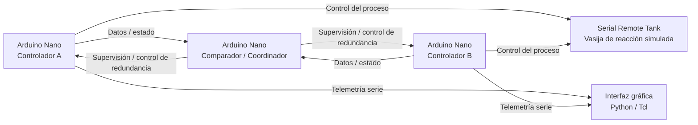

# Fail Tolerant DualNano

Sistema de control industrial tolerante a fallos mediante **redundancia activa por comparación**, desarrollado como Trabajo de Fin de Grado en Ingeniería de Computadores en la **Universidad de Málaga**.

El proyecto implementa una arquitectura distribuida basada en **tres Arduino Nano**, en la que dos microcontroladores ejecutan de forma redundante el control de un proceso industrial simulado y un tercer microcontrolador compara sus resultados, supervisa su funcionamiento y participa en la gestión de fallos.

El sistema se ha diseñado alrededor de una **vasija de reacción simulada**, permitiendo estudiar y demostrar el comportamiento de una arquitectura de control redundante ante discrepancias, reinicios, desconexiones y otros fallos de los controladores.

---

## Descripción del proyecto

En sistemas industriales críticos, un fallo del elemento encargado del control puede provocar la interrupción del proceso o, en determinados casos, situaciones potencialmente peligrosas. Una estrategia para aumentar la disponibilidad y tolerancia a fallos consiste en utilizar **redundancia en los elementos de control**.

Este proyecto desarrolla un prototipo funcional de una arquitectura de **redundancia activa por comparación**.

La arquitectura está formada por:

* **Controlador A**: ejecuta una instancia del algoritmo de control.
* **Controlador B**: ejecuta una segunda instancia independiente del mismo algoritmo.
* **Comparador**: recibe y compara las respuestas de ambos controladores, detecta discrepancias y participa en la gestión de errores.
* **Vasija de reacción simulada**: representa el proceso industrial que se desea controlar.
* **Interfaz gráfica**: permite supervisar el estado del sistema y visualizar la información procedente de los controladores.

Los dos controladores trabajan en paralelo sobre el proceso. Sus resultados se intercambian con el comparador, que determina si existe coherencia entre ambos. Cuando se detecta una discrepancia o la pérdida de uno de los controladores, la arquitectura dispone de mecanismos para gestionar la situación y mantener el funcionamiento del sistema dentro de las posibilidades de la implementación.

---

## Arquitectura general



La implementación combina comunicaciones serie, buses de comunicación entre microcontroladores y mecanismos específicos diseñados para permitir la operación cooperativa de los controladores redundantes.

---

## Componentes del sistema

### 1. Controladores redundantes

Los controladores A y B ejecutan en paralelo el algoritmo encargado de controlar la vasija de reacción.

Cada controlador mantiene información sobre el estado del proceso, procesa los datos disponibles y genera las órdenes necesarias para actuar sobre el sistema.

La duplicación permite comparar las decisiones generadas por ambas instancias y detectar comportamientos anómalos.

Repositorio:

**[CBI-Controller](https://github.com/Rafitata10/CBI-Controller)**

Tecnologías principales:

* C++
* Arduino Framework
* PlatformIO
* Arduino Nano / AVR
* Máquina de estados
* Comunicación SPI y serie
* Control del proceso simulado

---

### 2. Comparador y coordinador

El tercer Arduino actúa como elemento supervisor de la arquitectura redundante.

Su función principal es comparar la información proporcionada por los dos controladores y detectar discrepancias entre sus respuestas.

Además de la comparación de datos, el sistema implementa mecanismos relacionados con:

* sincronización de los controladores;
* detección de errores;
* pérdida temporal de un controlador;
* recuperación después de un reinicio;
* gestión mediante máquinas de estados;
* supervisión del estado de la arquitectura.

Repositorio:

**[CBI-Comparator](https://github.com/Rafitata10/CBI-Comparator)**

Tecnologías principales:

* C++
* Arduino Framework
* PlatformIO
* Arduino Nano / AVR
* Máquinas de estados
* Comparación de datos
* Interacción con hardware

---

### 3. Simulador de la vasija de reacción

El proceso industrial se representa mediante una versión modificada del **Serial Remote Tank (SRTank)** utilizado originalmente en PICSimLab.

Esta implementación permite representar las variables y elementos necesarios para el proceso de control, incluyendo variables asociadas a:

* temperatura;
* volumen;
* niveles;
* válvulas;
* calentador;
* refrigerador;
* agitador.

La versión modificada incorpora además funcionalidades específicas necesarias para el proyecto, como información relacionada con el estado del agitador y sus revoluciones.

Repositorio:

**[FT-DualNano-SRTank](https://github.com/Rafitata10/FT-DualNano-SRTank)**

Este componente constituye la representación software del proceso industrial que posteriormente será controlado por los controladores redundantes.

---

### 4. Biblioteca SRTank

La biblioteca `SRTank` proporciona una abstracción para que el software de control pueda interactuar con la vasija simulada.

Incluye funciones para consultar y modificar el estado del tanque, así como para controlar sus elementos principales.

Entre otras operaciones permite:

* consultar temperatura y volumen;
* consultar niveles;
* modificar límites;
* abrir y cerrar válvulas;
* activar y desactivar calentador y refrigerador;
* activar y desactivar el agitador;
* llenar y vaciar el tanque;
* calentar y enfriar el proceso;
* controlar el proceso de agitación.

Repositorio:

**[SRTank-Library](https://github.com/Rafitata10/SRTank-Library)**

Tecnologías principales:

* C++
* Arduino Framework
* PlatformIO
* `LiquidCrystal`
* `Wire`
* `OneWire`

---

### 5. Interfaz gráfica

El sistema incluye una interfaz gráfica para supervisar el funcionamiento de los dos controladores redundantes.

La aplicación recibe información mediante comunicación serie y transforma los datos recibidos en información visual que permite observar el estado de la arquitectura y del proceso.

La aplicación está desarrollada principalmente en Python y utiliza comunicación serie con los Arduino.

Repositorio:

**[FT_DualNano_GUI](https://github.com/Rafitata10/FT_DualNano_GUI)**

Tecnologías principales:

* Python
* Comunicación serie
* Tcl/Tk
* Visualización del estado del sistema

---

# Estructura del repositorio

Este repositorio actúa como **repositorio principal del TFG** y agrupa los diferentes componentes que originalmente se desarrollaron en repositorios independientes.

```text
FT-DualNano/
│
├── CBI-Controller/
│   └── Código de los controladores redundantes
│
├── CBI-Comparator/
│   └── Código del comparador/coordinador
│
├── FT-DualNano-GUI/
│   └── Interfaz gráfica de supervisión
│
├── SRTank-Library/
│   └── Biblioteca de control del tanque
│
├── SRTank/
│   └── Versión modificada del Serial Remote Tank
│
└── README.md
```

Cada directorio contiene el código correspondiente a uno de los componentes principales del sistema.

Los repositorios originales continúan disponibles de forma independiente:

| Componente             | Repositorio                                                            |
| ---------------------- | ---------------------------------------------------------------------- |
| Controlador redundante | [CBI-Controller](https://github.com/Rafitata10/CBI-Controller)         |
| Comparador             | [CBI-Comparator](https://github.com/Rafitata10/CBI-Comparator)         |
| Interfaz gráfica       | [FT_DualNano_GUI](https://github.com/Rafitata10/FT_DualNano_GUI)       |
| Biblioteca del tanque  | [SRTank-Library](https://github.com/Rafitata10/SRTank-Library)         |
| SRTank modificado      | [FT-DualNano-SRTank](https://github.com/Rafitata10/FT-DualNano-SRTank) |

---

# Flujo de funcionamiento

De forma simplificada, el funcionamiento del sistema es el siguiente:

```text
                   ┌─────────────────────┐
                   │ Proceso industrial  │
                   │   SRTank simulado   │
                   └──────────┬──────────┘
                              │
                    Datos del proceso
                              │
                 ┌────────────┴────────────┐
                 │                         │
                 ▼                         ▼
        ┌─────────────────┐       ┌─────────────────┐
        │  Controlador A  │       │  Controlador B  │
        │    Arduino      │       │    Arduino      │
        └────────┬────────┘       └────────┬────────┘
                 │                         │
                 │       Respuestas        │
                 └────────────┬────────────┘
                              ▼
                    ┌─────────────────┐
                    │   Comparador    │
                    │  / Coordinador  │
                    └────────┬────────┘
                             │
                     Gestión del fallo
                             │
                             ▼
                    Estado de la red
```

La filosofía fundamental del sistema es que ambos controladores puedan obtener y procesar información de manera redundante y que el comparador disponga de la información necesaria para determinar si sus respuestas son coherentes.

---

# Principales objetivos

El desarrollo del proyecto persigue los siguientes objetivos:

### Control del proceso

Diseñar e implementar un sistema capaz de controlar una vasija de reacción simulada mediante sensores, actuadores y un algoritmo de control.

### Redundancia

Diseñar una arquitectura con dos controladores que ejecuten simultáneamente el mismo proceso de control.

### Detección de fallos

Diseñar un mecanismo capaz de detectar discrepancias entre las respuestas de los controladores.

### Comunicación

Diseñar protocolos de comunicación que permitan el intercambio de información entre los diferentes microcontroladores de la arquitectura.

### Tolerancia a fallos

Permitir que el sistema pueda gestionar situaciones como:

* discrepancias entre controladores;
* pérdida temporal de uno de los controladores;
* reinicio de un controlador;
* desconexión manual;
* recuperación y resincronización.

### Supervisión

Desarrollar una interfaz gráfica que permita observar el estado de los controladores y del proceso de forma sencilla.

---

# Comunicaciones

Uno de los aspectos fundamentales del proyecto es el diseño de los mecanismos de comunicación entre los diferentes elementos de la arquitectura.

El proyecto estudia e implementa:

* **SPI (Serial Peripheral Interface)**;
* una implementación de **Custom SPI** adaptada a las necesidades del sistema;
* comunicación serie;
* un protocolo de transporte específico para la arquitectura redundante;
* mecanismos de sincronización entre controladores.

El diseño de estas comunicaciones tiene como objetivo permitir el intercambio de información de forma determinista y proporcionar los mecanismos necesarios para detectar pérdidas, discrepancias y estados inconsistentes.

---

# Máquinas de estados y gestión de fallos

La arquitectura utiliza **máquinas de estados** para representar y controlar las diferentes situaciones en las que puede encontrarse el sistema.

Entre los escenarios contemplados se encuentran:

```text
              ┌──────────────┐
              │ Funcionamiento│
              │    normal     │
              └──────┬───────┘
                     │
              discrepancia/error
                     │
                     ▼
              ┌──────────────┐
              │ Detección de │
              │    fallo     │
              └──────┬───────┘
                     │
             ┌───────┴────────┐
             │                │
             ▼                ▼
      Controlador activo   Recuperación
      continúa operando    / resincronización
```

La implementación contempla también la recuperación de un controlador después de un reinicio y la pérdida temporal de uno de los elementos redundantes.

---

# Implementación hardware

El prototipo físico utiliza **tres Arduino Nano**:

```text
┌───────────────────────────────────────────┐
│              Sistema FT-DualNano          │
│                                           │
│   Arduino Nano A ─── Controlador A        │
│                                           │
│   Arduino Nano B ─── Controlador B        │
│                                           │
│   Arduino Nano C ─── Comparador           │
│                                           │
└───────────────────────────────────────────┘
```

Además de los microcontroladores, el sistema emplea los elementos electrónicos necesarios para representar:

* sensores del proceso;
* actuadores;
* indicadores;
* pantallas;
* comunicaciones;
* control de la vasija de reacción.

El proyecto combina, por tanto, **hardware físico y simulación software** para crear un entorno de pruebas completo.

---

# Interfaz gráfica

La interfaz gráfica proporciona una capa de supervisión sobre la arquitectura.

Su funcionamiento se basa en la recepción de información desde los controladores mediante puertos serie y su posterior representación visual.

De esta forma es posible observar:

* estado de los controladores;
* información del proceso;
* respuestas obtenidas;
* situaciones de error;
* funcionamiento de la arquitectura redundante.

La GUI utiliza comunicación serie con los dispositivos y permite centralizar la supervisión del sistema desde un ordenador.

---

# Entorno de desarrollo

El proyecto utiliza diferentes herramientas dependiendo del componente.

| Componente     | Lenguaje     | Entorno / herramientas |
| -------------- | ------------ | ---------------------- |
| CBI-Controller | C++          | PlatformIO / Arduino   |
| CBI-Comparator | C++          | PlatformIO / Arduino   |
| SRTank-Library | C++          | PlatformIO / Arduino   |
| SRTank         | C++          | Make / PICSimLab       |
| GUI            | Python / Tcl | Python / Tk            |

La parte embebida está desarrollada utilizando el framework de Arduino y microcontroladores AVR.

---

# Pruebas realizadas

El sistema se ha diseñado para permitir la realización de diferentes pruebas de funcionamiento y tolerancia a fallos.

Entre ellas:

### Proceso químico completo

Ejecución completa del proceso de control de la vasija de reacción.

### Fallo provocado por software

Introducción deliberada de un error para comprobar la capacidad del sistema para detectar una discrepancia.

### Reinicio de un controlador

Reinicio manual de uno de los controladores para estudiar el proceso de recuperación y sincronización.

### Desconexión de un controlador

Desconexión física de uno de los controladores para comprobar el comportamiento de la arquitectura ante la pérdida de uno de sus elementos redundantes.

Estas pruebas permiten evaluar tanto el funcionamiento normal como las capacidades de detección y recuperación frente a fallos.

---

# Simulación software

Además de la implementación física, el proyecto estudia la posibilidad de ejecutar una versión simulada del sistema.

Para ello se analiza la adaptación de las comunicaciones utilizadas en el hardware hacia mecanismos disponibles en un entorno software, incluyendo:

* **Sockets TCP/IP**;
* **memoria compartida**;
* modificación del periférico SRTank en PICSimLab.

El objetivo es disponer de un entorno que facilite las pruebas y permita estudiar la arquitectura sin necesidad de utilizar continuamente todo el hardware físico.

---

# Relación con la memoria del TFG

El código contenido en este repositorio corresponde a los diferentes elementos software y hardware desarrollados a lo largo del proyecto.

De forma aproximada:

| Parte de la memoria      | Componentes relacionados             |
| ------------------------ | ------------------------------------ |
| Arquitectura del sistema | Todo el proyecto                     |
| Diseño del tanque        | `SRTank`, `SRTank-Library`           |
| Diseño de los buses      | `CBI-Controller`, `CBI-Comparator`   |
| Mecanismo redundante     | `CBI-Controller`, `CBI-Comparator`   |
| Implementación hardware  | Arduino + controladores + comparador |
| Interfaz gráfica         | `FT_DualNano_GUI`                    |
| Simulación software      | `FT-DualNano-SRTank`                 |
| Pruebas                  | Arquitectura completa                |

La memoria del proyecto describe con mayor detalle el diseño, las decisiones de implementación, los protocolos de comunicación, las máquinas de estados y los resultados obtenidos.

---

# Tecnologías


---

# Objetivos académicos

Este proyecto integra conocimientos de diferentes áreas de la Ingeniería de Computadores:

* sistemas embebidos;
* programación en C/C++;
* microcontroladores;
* electrónica digital;
* comunicaciones;
* protocolos de transporte;
* máquinas de estados;
* sistemas tolerantes a fallos;
* simulación;
* interfaces gráficas;
* integración hardware/software.

El resultado es un sistema experimental completo que permite estudiar la aplicación de técnicas de **redundancia y tolerancia a fallos en sistemas de control basados en microcontroladores**.

---

# Autor

**Rafael Ramírez Salas**

Ingeniería de Computadores
Universidad de Málaga

Trabajo de Fin de Grado — 2024

**Fail Tolerant DualNano**

---

# Licencia

Los diferentes componentes del proyecto se distribuyen bajo licencia **MIT**.

Consulta el `LICENSE` de cada repositorio para conocer los términos específicos aplicables a cada componente.

---

## Palabras clave

`Arduino` · `Arduino Nano` · `C++` · `Python` · `Embedded Systems` · `Fault Tolerance` · `Active Redundancy` · `Redundancy by Comparison` · `Industrial Control` · `Microcontrollers` · `SPI` · `Serial Communication` · `PICSimLab` · `SRTank`
